# 10分钟零基础就可搞懂的Hadoop架构原理，阿里架构师详解

作者：IT技术管理那些事儿2019-10-24 11:03:56

[开发](https://www.51cto.com/developer)[架构](https://www.51cto.com/architecture)[Hadoop](https://www.51cto.com/hadoop)

我今天花了大半个下午的时间，写了这篇hadoop的架构，全篇都是以大白话的形式，也算是为后面更加详细的每一部分开了个好头吧，如果喜欢请点转发和关注，如果有疑问，直接在评论里说出来，大家一起解决，才能进步。

我今天花了大半个下午的时间，写了这篇hadoop的架构，全篇都是以大白话的形式，也算是为后面更加详细的每一部分开了个好头吧，如果喜欢请点转发和关注，如果有疑问，直接在评论里说出来，大家一起解决，才能进步。

### **一、概念**

Hadoop诞生于2006年，是一款支持数据密集型分布式应用并以Apache 2.0许可协议发布的开源软件框架。它支持在商品硬件构建的大型集群上运行的应用程序。Hadoop是根据Google公司发表的MapReduce和Google档案系统的论文自行实作而成。

Hadoop与Google一样，都是小孩命名的，是一个虚构的名字，没有特别的含义。从计算机专业的角度看，Hadoop是一个分布式系统基础架构，由Apache基金会开发。Hadoop的主要目标是对分布式环境下的“大数据”以一种可靠、高效、可伸缩的方式处理。

Hadoop框架透明地为应用提供可靠性和数据移动。它实现了名为MapReduce的编程范式：应用程序被分割成许多小部分，而每个部分都能在集群中的任意节点上执行或重新执行。

Hadoop还提供了分布式文件系统，用以存储所有计算节点的数据，这为整个集群带来了非常高的带宽。MapReduce和分布式文件系统的设计，使得整个框架能够自动处理节点故障。它使应用程序与成千上万的独立计算的电脑和PB级的数据。

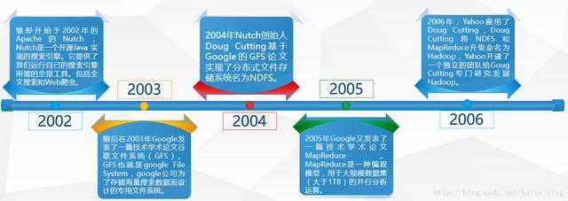

### 二、组成

**1.Hadoop的核心组件**

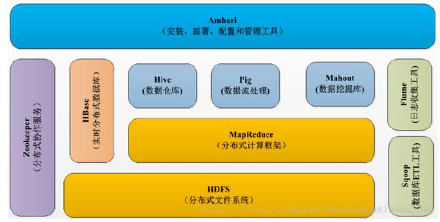

分析：Hadoop的核心组件分为：HDFS(分布式文件系统)、MapRuduce(分布式运算编程框架)、YARN(运算资源调度系统)

**2.HDFS的文件系统**

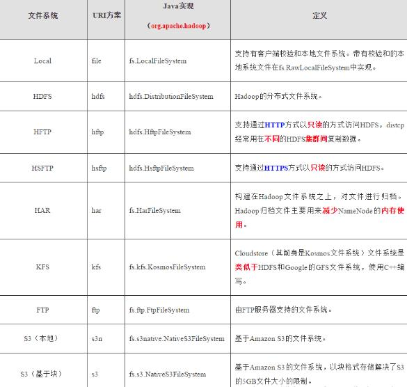

**HDFS**

1.定义

整个Hadoop的体系结构主要是通过HDFS(Hadoop分布式文件系统)来实现对分布式存储的底层支持，并通过MR来实现对分布式并行任务处理的程序支持。

HDFS是Hadoop体系中数据存储管理的基础。它是一个高度容错的系统，能检测和应对硬件故障，用于在低成本的通用硬件上运行。HDFS简化了文件的一致性模型，通过流式数据访问，提供高吞吐量应用程序数据访问功能，适合带有大型数据集的应用程序。

2.组成

HDFS采用主从(Master/Slave)结构模型，一个HDFS集群是由一个NameNode和若干个DataNode组成的。NameNode作为主服务器，管理文件系统命名空间和客户端对文件的访问操作。DataNode管理存储的数据。HDFS支持文件形式的数据。

从内部来看，文件被分成若干个数据块，这若干个数据块存放在一组DataNode上。NameNode执行文件系统的命名空间，如打开、关闭、重命名文件或目录等，也负责数据块到具体DataNode的映射。DataNode负责处理文件系统客户端的文件读写，并在NameNode的统一调度下进行数据库的创建、删除和复制工作。NameNode是所有HDFS元数据的管理者，用户数据永远不会经过NameNode。

分析：NameNode是管理者，DataNode是文件存储者、Client是需要获取分布式文件系统的应用程序。

**MapReduce**

1.定义

Hadoop MapReduce是google MapReduce 克隆版。

MapReduce是一种计算模型，用以进行大数据量的计算。其中Map对数据集上的独立元素进行指定的操作，生成键-值对形式中间结果。Reduce则对中间结果中相同“键”的所有“值”进行规约，以得到最终结果。MapReduce这样的功能划分，非常适合在大量计算机组成的分布式并行环境里进行数据处理。

2.组成

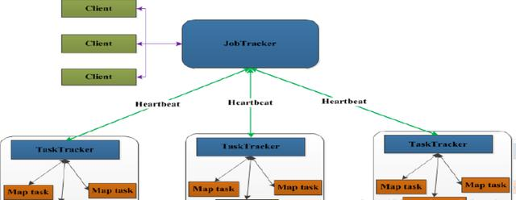

分析：

(1)JobTracker

JobTracker叫作业跟踪器，运行到主节点(Namenode)上的一个很重要的进程，是MapReduce体系的调度器。用于处理作业(用户提交的代码)的后台程序，决定有哪些文件参与作业的处理，然后把作业切割成为一个个的小task，并把它们分配到所需要的数据所在的子节点。

Hadoop的原则就是就近运行，数据和程序要在同一个物理节点里，数据在哪里，程序就跑去哪里运行。这个工作是JobTracker做的，监控task，还会重启失败的task(于不同的节点)，每个集群只有唯一一个JobTracker，类似单点的NameNode，位于Master节点

(2)TaskTracker

TaskTracker叫任务跟踪器，MapReduce体系的最后一个后台进程，位于每个slave节点上，与datanode结合(代码与数据一起的原则)，管理各自节点上的task(由jobtracker分配)，每个节点只有一个tasktracker，但一个tasktracker可以启动多个JVM，运行Map Task和Reduce Task;并与JobTracker交互，汇报任务状态，Map Task：解析每条数据记录，传递给用户编写的map(),并执行，将输出结果写入本地磁盘(如果为map-only作业，直接写入HDFS)。

Reducer Task：从Map Task的执行结果中，远程读取输入数据，对数据进行排序，将数据按照分组传递给用户编写的reduce函数执行。

**Hive**

1.定义

Hive是基于Hadoop的一个数据仓库工具，可以将结构化的数据文件映射为一张数据库表，并提供完整的sql查询功能，可以将sql语句转换为MapReduce任务进行运行。

Hive是建立在 Hadoop 上的数据仓库基础构架。它提供了一系列的工具，可以用来进行数据提取转化加载(ETL)，这是一种可以存储、查询和分析存储在 Hadoop 中的大规模数据的机制。

Hive 定义了简单的类 SQL 查询语言，称为 HQL，它允许熟悉 SQL 的用户查询数据。同时，这个语言也允许熟悉 MapReduce 开发者的开发自定义的 mapper 和 reducer 来处理内建的 mapper 和 reducer 无法完成的复杂的分析工作。

2.组成

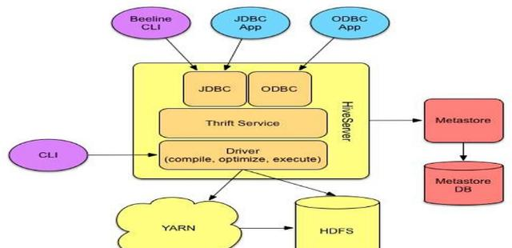

分析：Hive架构包括：CLI(Command Line Interface)、JDBC/ODBC、Thrift Server、WEB GUI、Metastore和Driver(Complier、Optimizer和Executor)，这些组件分为两大类：服务端组件和客户端组件

**3.客户端与服务端组件**

(1)客户端组件：

CLI：Command Line Interface，命令行接口。

Thrift客户端：上面的架构图里没有写上Thrift客户端，但是Hive架构的许多客户端接口是建立在Thrift客户端之上，包括JDBC和ODBC接口。

WEBGUI：Hive客户端提供了一种通过网页的方式访问Hive所提供的服务。这个接口对应Hive的HWI组件(Hive Web Interface)，使用前要启动HWI服务。

(2)服务端组件：

Driver组件：该组件包括Complier、Optimizer和Executor，它的作用是将HiveQL(类SQL)语句进行解析、编译优化，生成执行计划，然后调用底层的MapReduce计算框架。

Metastore组件：元数据服务组件，这个组件存储Hive的元数据，Hive的元数据存储在关系数据库里，Hive支持的关系数据库有Derby和Mysql。元数据对于Hive十分重要，因此Hive支持把Metastore服务独立出来，安装到远程的服务器集群里，从而解耦Hive服务和Metastore服务，保证Hive运行的健壮性;

Thrift服务：Thrift是Facebook开发的一个软件框架，它用来进行可扩展且跨语言的服务的开发，Hive集成了该服务，能让不同的编程语言调用Hive的接口。

**4.Hive与传统数据库的异同**

(1)查询语言

由于 SQL 被广泛的应用在数据仓库中，因此专门针对Hive的特性设计了类SQL的查询语言HQL。熟悉SQL开发的开发者可以很方便的使用Hive进行开发。

(2)数据存储位置

Hive是建立在Hadoop之上的，所有Hive的数据都是存储在HDFS中的。而数据库则可以将数据保存在块设备或者本地文件系统中。

(3)数据格式

Hive中没有定义专门的数据格式，数据格式可以由用户指定，用户定义数据格式需要指定三个属性：列分隔符(通常为空格、”\t”、”\\x001″)、行分隔符(”\n”)以及读取文件数据的方法(Hive中默认有三个文件格式TextFile，SequenceFile以及RCFile)。

(4)数据更新

由于Hive是针对数据仓库应用设计的，而数据仓库的内容是读多写少的。因此，Hive中不支持对数据的改写和添加，所有的数据都是在加载的时候中确定好的。而数据库中的数据通常是需要经常进行修改的，因此可以使用INSERT INTO … VALUES添加数据，使用UPDATE … SET修改数据。

(5)索引

Hive在加载数据的过程中不会对数据进行任何处理，甚至不会对数据进行扫描，因此也没有对数据中的某些Key建立索引。Hive要访问数据中满足条件的特定值时，需要暴力扫描整个数据，因此访问延迟较高。由于MapReduce的引入， Hive可以并行访问数据，因此即使没有索引，对于大数据量的访问，Hive仍然可以体现出优势。数据库中，通常会针对一个或者几个列建立索引，因此对于少量的特定条件的数据的访问，数据库可以有很高的效率，较低的延迟。由于数据的访问延迟较高，决定了Hive不适合在线数据查询。

(6)执行

Hive中大多数查询的执行是通过Hadoop提供的MapReduce来实现的(类似select * from tbl的查询不需要MapReduce)。而数据库通常有自己的执行引擎。

(7)执行延迟

Hive在查询数据的时候，由于没有索引，需要扫描整个表，因此延迟较高。另外一个导致Hive执行延迟高的因素是MapReduce框架。由于MapReduce本身具有较高的延迟，因此在利用MapReduce执行Hive查询时，也会有较高的延迟。相对的，数据库的执行延迟较低。当然，这个低是有条件的，即数据规模较小，当数据规模大到超过数据库的处理能力的时候，Hive的并行计算显然能体现出优势。

(8)可扩展性

由于Hive是建立在Hadoop之上的，因此Hive的可扩展性是和Hadoop的可扩展性是一致的(世界上比较大的Hadoop集群在Yahoo!，2009年的规模在4000台节点左右)。而数据库由于ACID语义的严格限制，扩展行非常有限。目前先进的并行数据库Oracle在理论上的扩展能力也只有100台左右。

(9)数据规模

由于Hive建立在集群上并可以利用MapReduce进行并行计算，因此可以支持很大规模的数据;对应的，数据库可以支持的数据规模较小。

**Hbase**

1.定义

HBase – Hadoop Database，是一个高可靠性、高性能、面向列、可伸缩的分布式存储系统，利用HBase技术可在廉价PC Server上搭建起大规模结构化存储集群。

HBase是Google Bigtable的开源实现，类似Google Bigtable利用GFS作为其文件存储系统，HBase利用Hadoop HDFS作为其文件存储系统;

Google运行MapReduce来处理Bigtable中的海量数据，HBase同样利用Hadoop MapReduce来处理HBase中的海量数据;

Google Bigtable利用 Chubby作为协同服务，HBase利用Zookeeper作为协同服务。

2.组成

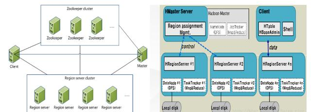

分析：从上图可以看出：Hbase主要由Client、Zookeeper、HMaster和HRegionServer组成，由Hstore作存储系统。

- Client

HBase Client使用HBase的RPC机制与HMaster和HRegionServer进行通信，对于管理类操作，Client与 HMaster进行RPC;对于数据读写类操作，Client与HRegionServer进行RPC

- Zookeeper

Zookeeper Quorum 中除了存储了 -ROOT- 表的地址和 HMaster 的地址，HRegionServer 也会把自己以 Ephemeral 方式注册到 Zookeeper 中，使得 HMaster 可以随时感知到各个HRegionServer 的健康状态。

- HMaster

HMaster 没有单点问题，HBase 中可以启动多个 HMaster ，通过 Zookeeper 的 Master Election 机制保证总有一个 Master 运行，HMaster 在功能上主要负责 Table和Region的管理工作：

- 管理用户对 Table 的增、删、改、查操作
- 管理 HRegionServer 的负载均衡，调整 Region 分布
- 在 Region Split 后，负责新 Region 的分配
- 在 HRegionServer 停机后，负责失效 HRegionServer 上的 Regions 迁移

HStore存储是HBase存储的核心了，其中由两部分组成，一部分是MemStore，一部分是StoreFiles。

MemStore是Sorted Memory Buffer，用户写入的数据首先会放入MemStore，当MemStore满了以后会Flush成一个StoreFile(底层实现是HFile)， 当StoreFile文件数量增长到一定阈值，会触发Compact合并操作，将多个 StoreFiles 合并成一个 StoreFile，合并过程中会进行版本合并和数据删除。

因此可以看出HBase其实只有增加数据，所有的更新和删除操作都是在后续的 compact 过程中进行的，这使得用户的写操作只要进入内存中就可以立即返回，保证了 HBase I/O 的高性能。

当StoreFiles Compact后，会逐步形成越来越大的StoreFile，当单个 StoreFile 大小超过一定阈值后，会触发Split操作，同时把当前 Region Split成2个Region，父 Region会下线，新Split出的2个孩子Region会被HMaster分配到相应的HRegionServer 上，使得原先1个Region的压力得以分流到2个Region上。

### 三、Hadoop的应用实例

**1.回顾Hadoop的整体架构**

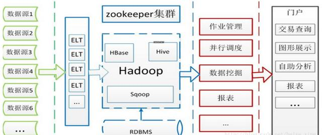

**2.Hadoop的应用——流量查询系统**

(1)流量查询系统总体框架

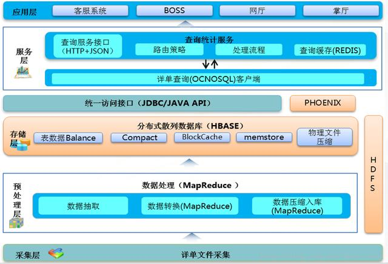

(2)流量查询系统总体流程

(3)流量查询系统数据预处理功能框架

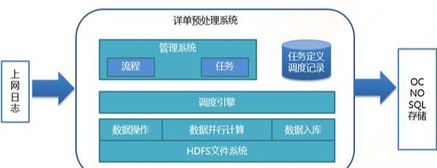

(4)流量查询系统数据预处理流程

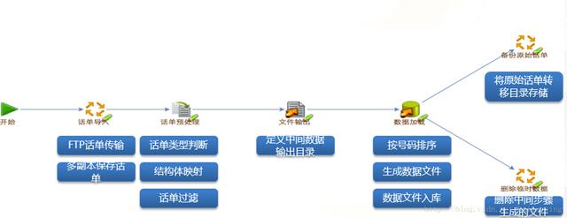

(5)流量查询NoSQL数据库功能框架

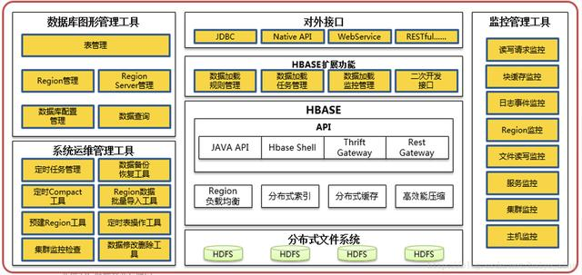

(6)流量查询服务功能框架

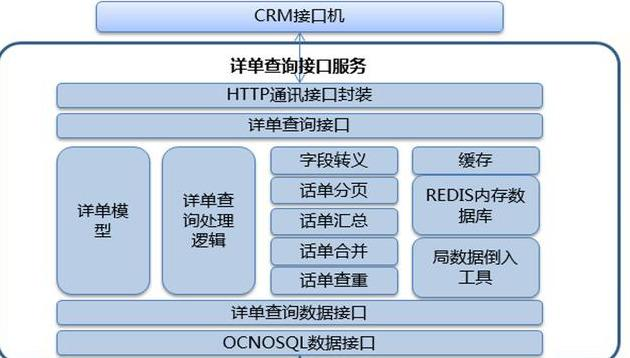

(7)实时流计算数据处理流程图

 

 

责任编辑：华轩来源： [今日头条](https://www.toutiao.com/a6750933194524066308/)

[Hadoop](https://so.51cto.com/?keywords=Hadoop)[Google](https://so.51cto.com/?keywords=Google)[硬件](https://so.51cto.com/?keywords=硬件)