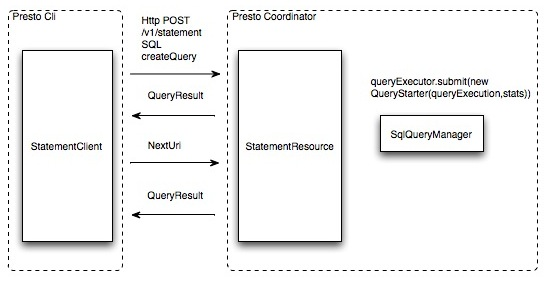
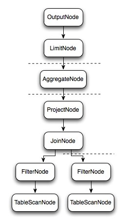
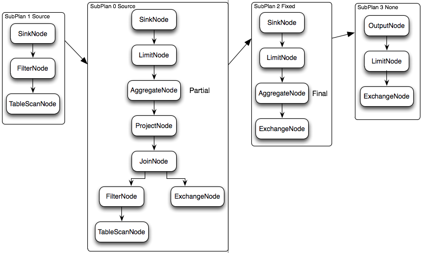
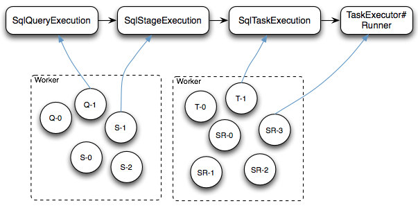
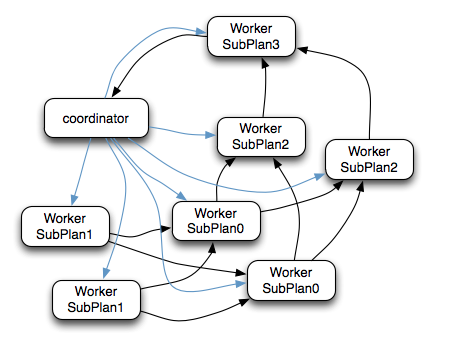
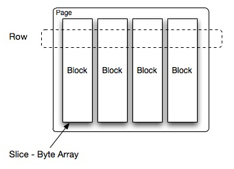

# [Presto实现原理和美团的使用实践](https://tech.meituan.com/2014/06/16/presto.html)

2014年06月16日 作者: 木叶丸 本文已发表在《程序员》2014.6月刊 [文章链接](https://tech.meituan.com/2014/06/16/presto.html) 11121字 23分钟阅读

Facebook的数据仓库存储在少量大型Hadoop/HDFS集群。Hive是Facebook在几年前专为Hadoop打造的一款数据仓库工具。在以前，Facebook的科学家和分析师一直依靠Hive来做数据分析。但Hive使用MapReduce作为底层计算框架，是专为批处理设计的。但随着数据越来越多，使用Hive进行一个简单的数据查询可能要花费几分到几小时，显然不能满足交互式查询的需求。Facebook也调研了其他比Hive更快的工具，但它们要么在功能有所限制要么就太简单，以至于无法操作Facebook庞大的数据仓库。

2012年开始试用的一些外部项目都不合适，他们决定自己开发，这就是Presto。2012年秋季开始开发，目前该项目已经在超过 1000名Facebook雇员中使用，运行超过30000个查询，每日数据在1PB级别。Facebook称Presto的性能比Hive要好上10倍多。2013年Facebook正式宣布开源Presto。

本文首先介绍Presto从用户提交SQL到执行的这一个过程，然后尝试对Presto实现实时查询的原理进行分析和总结，最后介绍Presto在美团的使用情况。

## Presto架构


presto架构图


Presto查询引擎是一个Master-Slave的架构，由一个Coordinator节点，一个Discovery Server节点，多个Worker节点组成，Discovery Server通常内嵌于Coordinator节点中。Coordinator负责解析SQL语句，生成执行计划，分发执行任务给Worker节点执行。Worker节点负责实际执行查询任务。Worker节点启动后向Discovery Server服务注册，Coordinator从Discovery Server获得可以正常工作的Worker节点。如果配置了Hive Connector，需要配置一个Hive MetaStore服务为Presto提供Hive元信息，Worker节点与HDFS交互读取数据。

## Presto执行查询过程简介

既然Presto是一个交互式的查询引擎，我们最关心的就是Presto实现低延时查询的原理，我认为主要是下面几个关键点，当然还有一些传统的SQL优化原理，这里不介绍了。

1. 完全基于内存的并行计算
2. 流水线
3. 本地化计算
4. 动态编译执行计划
5. 小心使用内存和数据结构
6. 类BlinkDB的近似查询
7. GC控制

为了介绍上述几个要点，这里先介绍一下Presto执行查询的过程

### 提交查询

用户使用Presto Cli提交一个查询语句后，Cli使用HTTP协议与Coordinator通信，Coordinator收到查询请求后调用SqlParser解析SQL语句得到Statement对象，并将Statement封装成一个QueryStarter对象放入线程池中等待执行。



提交查询


### SQL编译过程

Presto与Hive一样，使用Antlr编写SQL语法，语法规则定义在Statement.g和StatementBuilder.g两个文件中。 如下图中所示从SQL编译为最终的物理执行计划大概分为5部，最终生成在每个Worker节点上运行的LocalExecutionPlan，这里不详细介绍SQL解析为逻辑执行计划的过程，通过一个SQL语句来理解查询计划生成之后的计算过程。


SQL解析过程


样例SQL：

```
select c1.rank, count(*) from dim.city c1 join dim.city c2 on c1.id = c2.id where c1.id > 10 group by c1.rank limit 10;
```



逻辑执行计划


上面的SQL语句生成的逻辑执行计划Plan如上图所示。那么Presto是如何对上面的逻辑执行计划进行拆分以较高的并行度去执行完这个计划呢，我们来看看物理执行计划。

### 物理执行计划

逻辑执行计划图中的虚线就是Presto对逻辑执行计划的切分点，逻辑计划Plan生成的SubPlan分为四个部分，每一个SubPlan都会提交到一个或者多个Worker节点上执行。

SubPlan有几个重要的属性planDistribution、outputPartitioning、partitionBy属性。

1. PlanDistribution表示一个查询Stage的分发方式，逻辑执行计划图中的4个SubPlan共有3种不同的PlanDistribution方式：Source表示这个SubPlan是数据源，Source类型的任务会按照数据源大小确定分配多少个节点进行执行；Fixed表示这个SubPlan会分配固定的节点数进行执行（Config配置中的query.initial-hash-partitions参数配置，默认是8）；None表示这个SubPlan只分配到一个节点进行执行。在下面的执行计划中，SubPlan1和SubPlan0 PlanDistribution=Source，这两个SubPlan都是提供数据源的节点，SubPlan1所有节点的读取数据都会发向SubPlan0的每一个节点；SubPlan2分配8个节点执行最终的聚合操作；SubPlan3只负责输出最后计算完成的数据。
2. OutputPartitioning属性只有两个值HASH和NONE，表示这个SubPlan的输出是否按照partitionBy的key值对数据进行Shuffle。在下面的执行计划中只有SubPlan0的OutputPartitioning=HASH，所以SubPlan2接收到的数据是按照rank字段Partition后的数据。



物理执行计划


### 完全基于内存的并行计算

#### 查询的并行执行流程

Presto SQL的执行流程如下图所示

1. Cli通过HTTP协议提交SQL查询之后，查询请求封装成一个SqlQueryExecution对象交给Coordinator的SqlQueryManager#queryExecutor线程池去执行
2. 每个SqlQueryExecution线程（图中Q-X线程）启动后对查询请求的SQL进行语法解析和优化并最终生成多个Stage的SqlStageExecution任务，每个SqlStageExecution任务仍然交给同样的线程池去执行
3. 每个SqlStageExecution线程（图中S-X线程）启动后每个Stage的任务按PlanDistribution属性构造一个或者多个RemoteTask通过HTTP协议分配给远端的Worker节点执行
4. Worker节点接收到RemoteTask请求之后，启动一个SqlTaskExecution线程（图中T-X线程）将这个任务的每个Split包装成一个PrioritizedSplitRunner任务（图中SR-X）交给Worker节点的TaskExecutor#executor线程池去执行



查询执行流程


上面的执行计划实际执行效果如下图所示。

1. Coordinator通过HTTP协议调用Worker节点的 /v1/task 接口将执行计划分配给所有Worker节点（图中蓝色箭头）
2. SubPlan1的每个节点读取一个Split的数据并过滤后将数据分发给每个SubPlan0节点进行Join操作和Partial Aggr操作
3. SubPlan1的每个节点计算完成后按GroupBy Key的Hash值将数据分发到不同的SubPlan2节点
4. 所有SubPlan2节点计算完成后将数据分发到SubPlan3节点
5. SubPlan3节点计算完成后通知Coordinator结束查询，并将数据发送给Coordinator



执行计划计算流程


#### 源数据的并行读取

在上面的执行计划中SubPlan1和SubPlan0都是Source节点，其实它们读取HDFS文件数据的方式就是调用的HDFS InputSplit API，然后每个InputSplit分配一个Worker节点去执行，每个Worker节点分配的InputSplit数目上限是参数可配置的，Config中的query.max-pending-splits-per-node参数配置，默认是100。

#### 分布式的Hash聚合

上面的执行计划在SubPlan0中会进行一次Partial的聚合计算，计算每个Worker节点读取的部分数据的部分聚合结果，然后SubPlan0的输出会按照group by字段的Hash值分配不同的计算节点，最后SubPlan3合并所有结果并输出

### 流水线

#### 数据模型

Presto中处理的最小数据单元是一个Page对象，Page对象的数据结构如下图所示。一个Page对象包含多个Block对象，每个Block对象是一个字节数组，存储一个字段的若干行。多个Block横切的一行是真实的一行数据。一个Page最大1MB，最多16*1024行数据。



数据模型


#### 节点内部流水线计算

下图是一个Worker节点内部的计算流程图，左侧是任务的执行流程图。

Worker节点将最细粒度的任务封装成一个PrioritizedSplitRunner对象，放入pending split优先级队列中。每个

Worker节点启动一定数目的线程进行计算，线程数task.shard.max-threads=availableProcessors() * 4，在config中配置。

每个空闲的线程从队列中取出一个PrioritizedSplitRunner对象执行，如果执行完成一个周期，超过最大执行时间1秒钟，判断任务是否执行完成，如果完成，从allSplits队列中删除，如果没有，则放回pendingSplits队列中。

每个任务的执行流程如下图右侧，依次遍历所有Operator，尝试从上一个Operator取一个Page对象，如果取得的Page不为空，交给下一个Operator执行。


节点内部流水线计算


#### 节点间流水线计算

下图是ExchangeOperator的执行流程图，ExchangeOperator为每一个Split启动一个HttpPageBufferClient对象，主动向上一个Stage的Worker节点拉数据，数据的最小单位也是一个Page对象，取到数据后放入Pages队列中


节点间流水线计算


### 本地化计算

Presto在选择Source任务计算节点的时候，对于每一个Split，按下面的策略选择一些minCandidates

1. 优先选择与Split同一个Host的Worker节点
2. 如果节点不够优先选择与Split同一个Rack的Worker节点
3. 如果节点还不够随机选择其他Rack的节点

对于所有Candidate节点，选择assignedSplits最少的节点。

### 动态编译执行计划

Presto会将执行计划中的ScanFilterAndProjectOperator和FilterAndProjectOperator动态编译为Byte Code，并交给JIT去编译为native代码。Presto也使用了Google Guava提供的LoadingCache缓存生成的Byte Code。


动态编译执行计划


动态编译执行计划


上面的两段代码片段中，第一段为没有动态编译前的代码，第二段代码为动态编译生成的Byte Code反编译之后还原的优化代 码，我们看到这里采用了循环展开的优化方法。

循环展开最常用来降低循环开销，为具有多个功能单元的处理器提供指令级并行。也有利于指令流水线的调度。

### 小心使用内存和数据结构

使用Slice进行内存操作，Slice使用Unsafe#copyMemory实现了高效的内存拷贝，Slice仓库参考：https://github.com/airlift/slice

Facebook工程师在另一篇介绍ORCFile优化的文章中也提到使用Slice将ORCFile的写性能提高了20%~30%，参考：https://code.facebook.com/posts/229861827208629/scaling-the-facebook-data-warehouse-to-300-pb/

### 类BlinkDB的近似查询

为了加快avg、count distinct、percentile等聚合函数的查询速度，Presto团队与BlinkDB作者之一Sameer Agarwal合作引入了一些近似查询函数approx_avg、approx_distinct、approx_percentile。approx_distinct使用HyperLogLog Counting算法实现。

### GC控制

Presto团队在使用hotspot java7时发现了一个JIT的BUG，当代码缓存快要达到上限时，JIT可能会停止工作，从而无法将使用频率高的代码动态编译为native代码。

Presto团队使用了一个比较Hack的方法去解决这个问题，增加一个线程在代码缓存达到70%以上时进行显式GC，使得已经加载的Class从perm中移除，避免JIT无法正常工作的BUG。

### Presto TPCH benchmark测试

介绍了上述这么多点，我们最关心的还是Presto性能测试，Presto中实现了TPCH的标准测试，下面的表格给出了Presto 0.60 TPCH的测试结果。直接运行presto-main/src/test/java/com/facebook/presto/benchmark/BenchmarkSuite.java。

```
benchmarkName cpuNanos(MILLISECONDS) inputRows inputBytes inputRows/s inputBytes/s outputRows outputBytes outputRows/s outputBytes/s
                      count_agg     2.055ms   1.5M  12.9MB    730M/s  6.12GB/s      1      9B     486/s  4.28KB/s
                 double_sum_agg    14.792ms   1.5M  12.9MB    101M/s   870MB/s      1      9B      67/s    608B/s
                       hash_agg   174.576ms   1.5M  21.5MB   8.59M/s   123MB/s      3     45B      17/s    257B/s
               predicate_filter    68.387ms   1.5M  12.9MB   21.9M/s   188MB/s  1.29M  11.1MB   18.8M/s   162MB/s
                     raw_stream     1.899ms   1.5M  12.9MB    790M/s  6.62GB/s   1.5M  12.9MB    790M/s  6.62GB/s
                         top100    58.735ms   1.5M  12.9MB   25.5M/s   219MB/s    100    900B    1.7K/s    15KB/s
         in_memory_orderby_1.5M  1909.524ms   1.5M  41.5MB    786K/s  21.7MB/s   1.5M  28.6MB    786K/s    15MB/s
                     hash_build   588.471ms   1.5M  25.7MB   2.55M/s  43.8MB/s   1.5M  25.7MB   2.55M/s  43.8MB/s
                      hash_join  2400.006ms     6M   103MB    2.5M/s  42.9MB/s     6M   206MB    2.5M/s  85.8MB/s
            hash_build_and_join  2996.489ms   7.5M   129MB    2.5M/s    43MB/s     6M   206MB      2M/s  68.8MB/s
              hand_tpch_query_1  3146.931ms     6M   361MB   1.91M/s   115MB/s      4    300B       1/s     95B/s
              hand_tpch_query_6   345.960ms     6M   240MB   17.3M/s   695MB/s      1      9B       2/s     26B/s
sql_groupby_agg_with_arithmetic  1211.444ms     6M   137MB   4.95M/s   113MB/s      2     30B       1/s     24B/s
                  sql_count_agg     3.635ms   1.5M  12.9MB    413M/s  3.46GB/s      1      9B     275/s  2.42KB/s
             sql_double_sum_agg    16.960ms   1.5M  12.9MB   88.4M/s   759MB/s      1      9B      58/s    530B/s
          sql_count_with_filter    81.641ms   1.5M  8.58MB   18.4M/s   105MB/s      1      9B      12/s    110B/s
                sql_groupby_agg   169.748ms   1.5M  21.5MB   8.84M/s   126MB/s      3     45B      17/s    265B/s
           sql_predicate_filter    46.540ms   1.5M  12.9MB   32.2M/s   277MB/s  1.29M  11.1MB   27.7M/s   238MB/s
                 sql_raw_stream     3.374ms   1.5M  12.9MB    445M/s  3.73GB/s   1.5M  12.9MB    445M/s  3.73GB/s
                    sql_top_100    60.663ms   1.5M  12.9MB   24.7M/s   212MB/s    100    900B   1.65K/s  14.5KB/s
                  sql_hash_join  4421.159ms   7.5M   129MB    1.7M/s  29.1MB/s     6M   206MB   1.36M/s  46.6MB/s
        sql_join_with_predicate  1008.909ms   7.5M   116MB   7.43M/s   115MB/s      1      9B       0/s      8B/s
              sql_varbinary_max   224.510ms     6M  97.3MB   26.7M/s   433MB/s      1     21B       4/s     93B/s
             sql_distinct_multi   257.958ms   1.5M    32MB   5.81M/s   124MB/s      5    112B      19/s    434B/s
            sql_distinct_single   112.849ms   1.5M  12.9MB   13.3M/s   114MB/s      1      9B       8/s     79B/s
               sql_tpch_query_1  3168.782ms     6M   361MB   1.89M/s   114MB/s      4    336B       1/s    106B/s
               sql_tpch_query_6   286.281ms     6M   240MB     21M/s   840MB/s      1      9B       3/s     31B/s
                       sql_like  3497.154ms     6M   232MB   1.72M/s  66.3MB/s  1.15M  9.84MB    328K/s  2.81MB/s
                         sql_in    80.267ms     6M  51.5MB   74.8M/s   642MB/s     25    225B     311/s  2.74KB/s
                sql_semijoin_in  1945.074ms   7.5M  64.4MB   3.86M/s  33.1MB/s     3M  25.8MB   1.54M/s  13.2MB/s
                sql_regexp_like  2233.004ms   1.5M  76.6MB    672K/s  34.3MB/s      1      9B       0/s      4B/s
     sql_approx_percentile_long   587.748ms   1.5M  12.9MB   2.55M/s  21.9MB/s      1      9B       1/s     15B/s
               sql_between_long    53.433ms   1.5M  12.9MB   28.1M/s   241MB/s      1      9B      18/s    168B/s
sampled_sql_groupby_agg_with_arithmetic  1369.485ms    6M   189MB   4.38M/s   138MB/s      2     30B       1/s     21B/s
          sampled_sql_count_agg    11.367ms   1.5M  12.9MB    132M/s  1.11GB/s      1      9B      87/s    791B/s
sampled_sql_join_with_predicate  1338.238ms   7.5M   180MB   5.61M/s   135MB/s      1      9B       0/s      6B/s
     sampled_sql_double_sum_agg    24.638ms   1.5M  25.7MB   60.9M/s  1.02GB/s      1      9B      40/s    365B/s
             stat_long_variance    26.390ms   1.5M  12.9MB   56.8M/s   488MB/s      1      9B      37/s    341B/s
         stat_long_variance_pop    26.583ms   1.5M  12.9MB   56.4M/s   484MB/s      1      9B      37/s    338B/s
           stat_double_variance    26.601ms   1.5M  12.9MB   56.4M/s   484MB/s      1      9B      37/s    338B/s
       stat_double_variance_pop    26.371ms   1.5M  12.9MB   56.9M/s   488MB/s      1      9B      37/s    341B/s
               stat_long_stddev    26.266ms   1.5M  12.9MB   57.1M/s   490MB/s      1      9B      38/s    342B/s
           stat_long_stddev_pop    26.350ms   1.5M  12.9MB   56.9M/s   489MB/s      1      9B      37/s    341B/s
             stat_double_stddev    26.316ms   1.5M  12.9MB     57M/s   489MB/s      1      9B      38/s    342B/s
         stat_double_stddev_pop    26.360ms   1.5M  12.9MB   56.9M/s   488MB/s      1      9B      37/s    341B/s
 sql_approx_count_distinct_long    35.763ms   1.5M  12.9MB   41.9M/s   360MB/s      1      9B      27/s    251B/s
sql_approx_count_distinct_double    37.198ms   1.5M  12.9MB   40.3M/s   346MB/s      1      9B      26/s    241B/s
```

## 美团如何使用Presto

### 选择presto的原因

2013年我们也用过一段时间的impala，当时impala不支持线上1.x的hadoop社区版，所以搭了一个CDH的小集群，每天将大集群的热点数据导入小集群。但是hadoop集群年前完成升级2.2之后，当时的impala还不支持2.2 hadoop版本。而Presto刚好开始支持2.x hadoop社区版，并且Presto在Facebook 300PB大数据量的环境下可以成功的得到大量使用，我们相信它在美团也可以很好的支撑我们实时分析的需求，于是决定先上线测试使用一段时间。

### 部署和使用形式

考虑到两个原因：1、由于Hadoop集群主要是夜间完成昨天的计算任务，白天除了日志写入外，集群的计算负载较低。2、Presto Worker节点与DataNode节点布置在一台机器上可以本地计算。因此我们将Presto部署到了所有的DataNode机器上，并且夜间停止Presto服务，避免占用集群资源，夜间基本也不会有用户查询数据。

### Presto二次开发和BUG修复

年后才正式上线Presto查询引擎，0.60版本，使用的时间不长，但是也遇到了一些问题：

1. 美团的Hadoop使用的是2.2版本，并且开启了Security模式，但是Presto不支持Kerberos认证，我们修改了Presto代码，增加了Kerberos认证的功能。
2. Presto还不支持SQL的隐式类型转换，而Hive支持，很多自助查询的用户习惯了Hive，导致使用Presto时都会出现表达式中左右变量类型不匹配的问题，我们增加了隐式类型转换的功能，大大减小了用户SQL出错的概率。
3. Presto不支持查询lzo压缩的数据，需要修改hadoop-lzo的代码。
4. 解决了一个having子句中有distinct字段时查询失败的BUG，并反馈了Presto团队  https://github.com/facebook/presto/pull/1104

所有代码的修改可以参考我们在github上的仓库 https://github.com/MTDATA/presto/commits/mt-0.60

### 实际使用效果

这里给出一个公司内部开放给分析师、PM、工程师进行自助查询的查询中心的一个测试报告。这里选取了平时的5000个Hive查询，通过Presto查询的对比见下面的表格。

| 自助查询sql数 | hive    | presto | presto/hive    |
| :------------ | :------ | :----- | :------------- |
| 1424          | 154427s | 27708s | 0.179424582489 |

## 参考

- Presto官方文档 http://prestodb.io/
- Facebook Presto团队介绍Presto的文章 https://www.facebook.com/notes/facebook-engineering/presto-interacting-with-petabytes-of-data-at-facebook/10151786197628920
- SlideShare两个分享Presto 的PPT http://www.slideshare.net/zhusx/presto-overview?from_search=1 http://www.slideshare.net/frsyuki/hadoop-source-code-reading-15-in-japan-presto