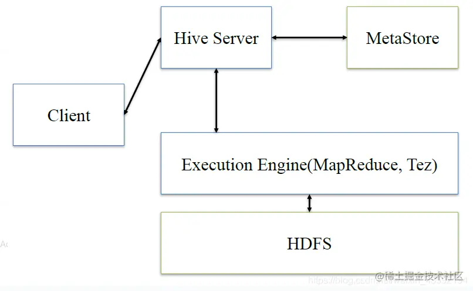
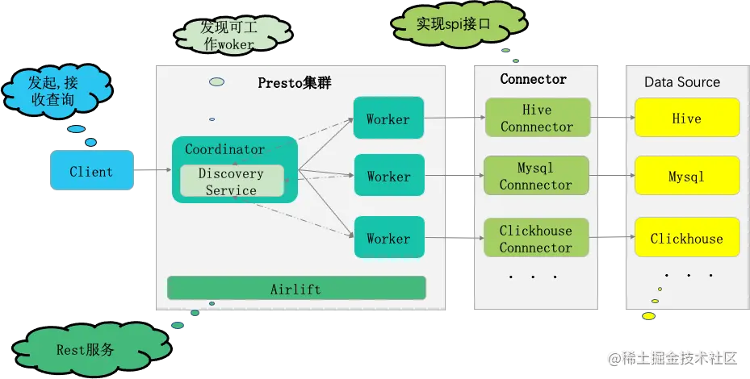
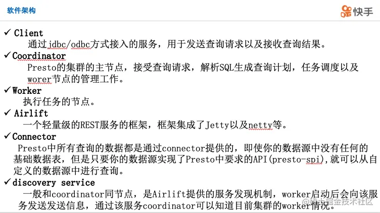
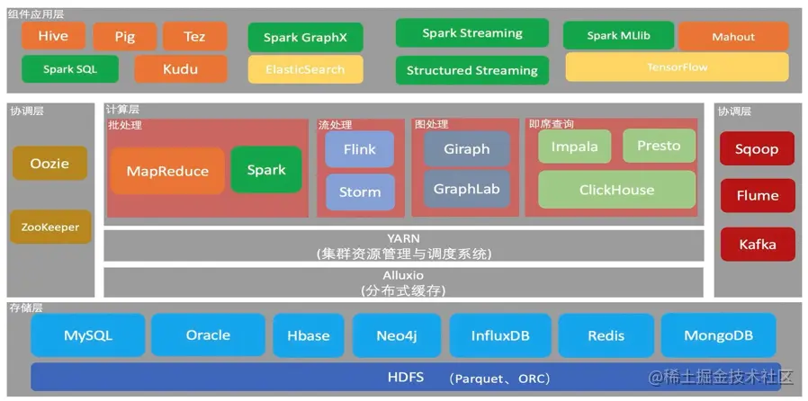
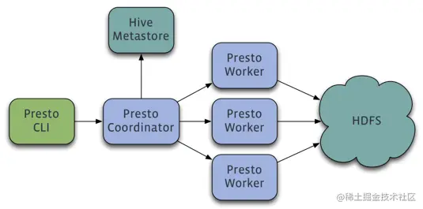
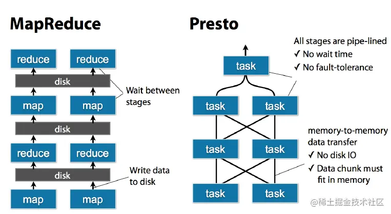

# presto：介绍

[import_random](https://juejin.cn/user/2013961033882312/posts)

2021-05-012,091阅读12分钟

# 参考网址

[blog.csdn.net/weixin_4359…](https://link.juejin.cn/?target=https%3A%2F%2Fblog.csdn.net%2Fweixin_43592194%2Farticle%2Fdetails%2F87596695)

# 总结

```vbnet
vbnet复制代码分布式，基于内存
并不是一次性把所有的数据都写入到内存，而是从datastore（数据源）中读取一部分数据放入内存处理，然后抛出，然后再读取一部分数据放入内存处理再抛出。。。。

是一个分布式计算引擎（sql查询），不能存储数据，需要和别的存储系统一起使用。
可以从多种数据源读取数据，可以是非关系型的数据源，也可以是关系型的数据源。
这就是presto牛逼的地方，(因为工作需要从不同的地方读取数据，比如hive,mysql等，所以presto很合适)

OLTP: 在线事务处理(On-Line Transaction Processing)，presto不擅长
OLAP: 在线分析处理（online Analytic Processing），presto擅长

transaction 事务
链接器：connector组件，可扩展的，因此可以从不同的数据源读取数据。
       当你需要链接一个新的数据库的时候，你只需要在这个connector组件中扩展一个心的链接器就可以了。
       
协调器：把协调服务部署在某一个节点上，这个节点就成了协调器。
       协调器接收用户写的sql代码，进行解析，然后把整个任务分成不同的阶段stage，
       类似于流水线，pipeline，
       这样可以完全在内存中计算，极大的减少了I/O，可以提升并行处理的速度。

虽然可以处理pb级别的数据，但是并不是把pb级别的数据放在内存中，而是一点一点的读取数据，放入内存，计算，清空内存，读取数据，放入内存，计算，清空内存......

支持多种类型的数据库 datastore ，可以跨数据源连表分析
```

# 1/presto是什么

```scss
scss复制代码facebook公司开源
分布式
基于内存（并不是一次性把数据都放在内存中，而是在计算中拿出一部分放在内存，计算，抛出，再拿，再计算）
并行计算
是一种Massively parallel processing (MPP)架构，多节点管道式执行，即大规模并行处理。
不太支持存储过程(及presto不能存储数据，只是分布式计算引擎)，
支持部分标准sql。
presto可以从多种数据源读取数据，比如msyql和hdfs，通过扩展式Connector组件实现
presto并不能用来处理在线事务。
处理GB~PB级别的数据
presto的查询速度比hive快5-10倍。
OLAP ： online Analytic Processing

Presto是一个分布式的查询计算引擎，本身并不存储数据，但是可以读取多种数据源，并且支持跨数据源的级联查询。Presto是一个OLAP的工具，擅长对海量(gb,tb,pb)数据进行复杂的分析；但是对于OLTP场景，并不是Presto所擅长，所以不要把Presto当做数据库来使用。
```

# 2/presto适合干什么

```sql
sql复制代码PB级海量数据复杂分析，交互式SQL查询，⽀持跨数据源进行数据查询和分析。
不像hive，只能从hdfs中读取数据。
```

# 3/presto不适合干什么

```bash
bash
复制代码多个大表的join操作，因为presto是基于内存的，多张大表在内存里可能放不下。
```

# 4/presto和hive的对比：

```bash
bash复制代码hive是一个数据仓库（有hive表），是一个交互式比较弱的查询引擎，
交互能力没有presto那么强，而且只能访问hdfs的数据(及数据源很单一)
presto是一个交互式查询引擎，可以在很短的时间内返回查询结果，秒级，分钟级，能访问很多数据源
hive在查询100Gb级别的数据时，消耗时间已经是分钟级了

但是presto是取代不了hive的，因为presto全部的数据都是在内存中，限制了在内存中的数据集大小，
比如多个大表的join，这些大表是不能完全放进内存的，所以presto不适合用在多个大表的join.
实际应用中，对于在presto的查询是有一定规定条件的:
    比如说一个查询在presto查询超过30分钟，那就kill掉吧，说明不适合在presto上使用，
    主要原因是，查询过大的话，会占用整个集群的资源，这会导致你后续的查询是没有资源的，
    这跟presto的设计理念是冲突的，就像是你进行一个查询，但是要等个5分钟才有资源给你用，
    这是很不合理的，交互式就变得弱了很多。
    我们理想的交互应该是实时的，速度越快越好。
    
Presto通过使用分布式查询，可以快速高效的完成海量数据的查询。
如果你需要处理TB或者PB级别的数据，那么你可能更希望借助于Hadoop的HDFS来完成这些数据的处理。
作为Hive和Pig（Hive和Pig都是通过MapReduce的管道流来完成HDFS数据的查询）的替代者，
Presto不仅可以访问HDFS，也可以操作不同的数据源，比如mysql
```

# 5/hive的基础架构

```vbscript
vbscript复制代码client将查询请求()发送到hive server，它会和metastor交互，获取表的元信息，如表的位置结构等，
之后hive server会进行语法解析，解析成语法树，变成查询计划，进行优化后，将查询计划交给执行引擎，默认是MR，然后翻译成MR
```



# 6/presto系统架构








```sql
sql复制代码Presto是一个分布式SQL查询计算引擎，它被设计为用来专门进行高速、实时的数据分析。
它支持标准的ANSI SQL，包括复杂查询，聚合，连接（join）和窗口函数（window functions)。
下图中展现了简化的Presto系统架构：
  <1>客户端（client）将SQL代码发送到Presto的协调器coordinator
  <2>协调器会进行语法检查、sql分析和规划查询计划(把整个任务划分成不同的stage阶段)
  <3>计划员（scheduler）将执行的管道组合在一起，将任务分配给那些里数据最近的节点，然后监控执行过程。 
  <4>客户端从输出端中将数据取出，这些数据是从更底层的处理段中依次取出的。
   
Presto的运行模型和Hive或MapReduce有着本质的区别。
Hive将sql代码解析成多阶段的MapReduce任务，一个接着一个地运行。
每一个任务从磁盘上读取输入数据并且将中间结果输出到磁盘上。
然而Presto引擎没有使用MapReduce，它使用了一个定制的查询和执行引擎和响应的操作符来支持SQL的语法。
除了改进的调度算法之外，所有的数据处理都是在内存中进行的。
不同的处理端通过网络组成处理的流水线。这样会避免不必要的磁盘读写和额外的延迟。
这种流水线式的执行模型会在同一时间运行多个数据处理段，一旦数据可用的时候就会将数据从一个处理段传入到下一个处理段。这样的方式会大大的减少各种查询的端到端响应时间。
   
```



```vbscript
vbscript复制代码Presto分布式计算引擎是一个Master-Slave的架构，，及主从架构
由一个Coordinator协调器节点，一个Discovery Server节点，多个Worker节点组成
Discovery Server通常内嵌于Coordinator节点中，也就是说coordinator和discorvery server可以部署在同一个节点上。
Coordinator负责语法检查，sql解析，生成执行计划，分发执行任务给Worker节点执行。 
Worker节点负责实际执行查询计算任务。Worker节点启动后向Discovery Server服务注册，Coordinator从Discovery Server获得可以正常工作的Worker节点。
如果配置了Hive Connector，需要配置一个Hive MetaStore服务为Presto提供Hive元信息，Worker节点与HDFS交互读取数据。
  
  
```

# 7/Presto特点

```sql
sql复制代码（1）完全基于内存的并行计算（不像mapreduce那样需要反复读取磁盘I/O）
（2）流水线，worker之间串联，即一个worker的输出是另一个worker输入
（3）本地化计算
（4）动态编译执行计划
（5）小心使用内存和数据结构
（6）类BlinkDB的近似查询
（7）GC控制
（8）扩展性
     work的扩展性
     connector组件的扩展性

 扩展性是在设计Presto时的另一个要点。
 在项目的早期阶段，Facebook就意识到除了HDFS之外，大量数据会被存储在很多其他类型的系统中。
 其中一些是像HBase一类的为人熟知的系统，另一类则是象Facebook New Feed一样的定制的后台
 Presto设计了一个简单的数据存储的抽象层，来满足在不同数据存储系统之上都可以使用SQL进行查询。存储插件（连接器,connector）只需要提供实现以下操作的接口，包括对元数据 （metadata）的提取，获得数据存储的位置，获取数据本身的操作等。
 除了我们主要使用的Hive/HDFS后台系统之外，Facebook也开发了一些连接其他系统的Presto 连接器，包括HBase，Scribe和定制开发的系统。
 作为Hive和Pig（Hive和Pig都是通过MapReduce的管道流来完成HDFS数据的查询）的替代者，Presto不仅可以访问HDFS，也可以操作不同的数据源，包括：RDBMS和其他的数据源（例如：Cassandra）。目前已经被支持的RDBMS有：MySQL、SQLServer、PostgreSQL等。
```

# 8/presto架构中的几个角色

```arduino
arduino复制代码<1>Coordinator：
   协调员，它主要的一个作用是接受client端的查询请求，
   将他们转换成各种各样的任务，将任务拆解后分发到多个worker去执行各种任务
    1、解析SQL语句
    2、⽣成执⾏计划（任务）
    3、分发执⾏任务给Worker节点执⾏

<2>Worker：
   真正的计算的节点，执行任务的节点，它接收到分配的任务后，
   就会到对应的数据源里面，去把数据提取出来，提取方式是通过各种各样的connector。

<3>Discovery service:
   是将coordinator和woker结合到一起的服务
     1、Worker节点启动后向Discovery Server服务注册
     2、Coordinator从Discovery Server获得Worker节点
```

# 9/coordinator和woker之间的关系是怎么维护的呢？

```arduino
arduino复制代码是通过Discovery Server，
所有的worker都把自己注册到Discovery Server上，
这样coordinator便可以从Discovery Server知道集群中有多少个worker能够给我工作，
然后我分配工作到worker时便有了根据。

 
```

# 10/presto的工作流程

```sql
sql复制代码<1>当我们执行一条sql，client把请求发送给coordinator，
   coordinator接收到这条sql语句以后，会进行语法检查，sql解析，任务划分成多阶段。
   它会有一个sql的语法解析器去把sql语法解析变成一个抽象的语法树AST，这抽象的语法树它里面只是进行一些语法解析，如果你的sql语句里面，比如说关键字你用的是int而不是Integer，就会在语法解析这里给暴露出来

<2>如果语法符合sql语法规范，之后会经过一个逻辑查询计划器的组件，他的主要作用是，比如说你sql里面出现的表，他会通过connector的方式去meta元数据里面把表的schema，列名，列的类型等，全部给找出来，将这些信息，跟语法树给对应起来，之后会生成一个物理的语法树节点，这个语法树节点里面，不仅拥有了它的查询关系，还拥有类型的关系，如果在这一步，数据库表里某一列的类型，跟你sql的类型不一致，就会在这里报错

3、如果通过，就会得到一个逻辑的查询计划，然后这个逻辑查询计划，会被送到一个分布式的逻辑查询计划器里面，进行一个分布式的解析，分布式解析里面，他就会去把对应的每一个查询计划转化为task

4、在每一个task里面，他会把对应的位置信息全部给提取出来，交给执行的plan，由plan把对应的task发给对应的worker去执行，这就是整个的一个过程

这是一个通用的sql解析流程，像hive也是遵循类似这样的流程，不一样的地方是distribution planner和executor pan，这里是各个引擎不一样的地方，前面基本上都一致的
```



# 11/presto的工作原理

```scss
scss复制代码presto是在hadoop上运行的分布式系统，使用和大规模并行处理(MPP)数据库管理系统相似的架构。
presto有一个协调器节点(其实就是在集群的某个节点上部署了一个用来协调的服务)，这个协调器节点和其他的工作节点是同步工作的。
用户把写好的sql代码提交给协调器，然后协调器会对sql代码进行解析,
presto会把请求处理到工作线程节点之间的多个阶段中。
所有的处理都是在内存中进行的。
是以流水线的形式进行的，有点类似于pipeline，这种方式可以避免不必要的I/O，加快并行处理的速度。

presto可以读取很多不同的数据源，非关系型的，和关系型的，都可以。
为了使得presto可以扩展到不同的数据源，它的设计采用了存储抽象化，可以很轻松的构建可插入的连接器。
```

# 12/presto和hadoop的区别

```bash
bash复制代码presto是一种开源的分布式sql查询引擎，可以对hdfs以及其他数据源中的数据进行快速的交互式的查询。
和hadoop/hdfs不同的是，presto没有自己的存储系统。
因此presto和hadoop互补。
```

# 13/presto的优缺点

```scss
scss复制代码<1>优点
   (1)和hive一样都可以处理PB级别的数据(GB<TB<PB)，但是presto是基于内存计算的，减少了不必要的I/O，因此速度比较快
   (2)可以从多种数据源读取数据，可以跨数据源连表查询。
      比如可以从hdfs查询大量的网站访问记录，然后从mysql中读取数据匹配出设备信息。
   
   (3)persto的部署很简单，因为hive是基于hdfs的，需要先部署hdfs.

<2>缺点
   (1)虽然可以处理pb级别的数据，但并不是把pb级别的数据都放在内存中计算。
      而是根据场景，比如count() avg()等计算，是边读数据边计算，然后再清空内存，再读取数据计算。
      这种场景并不十分消耗内存。
      但是如果是连表查询，就可能产生大量的临时数据，这种情况下presto速度就会慢，反而hive很擅长这种场景。
  
```

标签：

[Hadoop](https://juejin.cn/tag/Hadoop)[HDFS](https://juejin.cn/tag/HDFS)