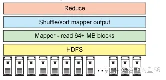

# hadoop体系简介

[会飞的鱼66](https://www.zhihu.com/people/hui-fei-de-yu-66-47)

大数据从业者，大数据知识分享

已关注

## **hadoop核心**

Apache Hadoop 项目有两个核心组件，被称为 Hadoop 分布式文件系统 (Hadoop Distributed File System, HDFS) 的文件存储，以及被称为 MapReduce 的编程框架。有一些支持项目充分利用了 HDFS 和 MapReduce。

## **支持商**

Hadoop有两个主要支持商HortonWorks (代表社区)和 Cloudera (代表商业)， HortonWorks发布的安装包叫 Ambari ， Cloudera发布的安装包叫 CDH (截至本文发布最新为CDH5)。其实还有一个MapR因为用的人不多，我就不介绍了

**选择建议：**

我也不知道选什么好，因为我只用过cdh的版本，只是因为他看起来更商业化，可能会更稳定吧，不过cdh的官方文档都是英文而且写的很杂乱。如果你找不到什么cdh的资料可以看下我博客里面关于hadoop的文章，这些都是是我在cdh官方文档的基础上翻译和改进的

## **生态圈**

下面介绍下Hadoop庞大的开源生态圈的一些组件（主要还是以CDH5官方安装教程有提到的为主）。由于条目众多，我会列出学习的优先级：高，低。优先级低的只需要了解就好了，基本工作中都可能不会用到。所以大家一上手的时候只需要高这个级别的就好了，低的等闲的没事干的时候去看下。

## **HDFS [高]**

hadoop做出了一个虚拟文件系统，在这个系统上你以为你创建了一个文件，其实这个文件有可能被同时存放在很多台机子上，这样就让你的系统表面上看起来是一个空间，实际上是很多服务器的磁盘构成的，这就是分布式操作系统

## **YARN (MapReduce2.0) [高]**

这是一个面向 Hadoop 的编程模型。有两个阶段，它们分别被称为 Map 和 Reduce。在分布式系统上进行计算操作基本都是由这两个概念步骤组成的，因为分布式系统，并不像一般的数据库或者文件系统，不能从上至下，或者从第一条开始进行求和等操作，就需要一种由分散的节点不断向一个点聚拢的计算过程。

## **HBase [高]**

HBase是一个分布式的、面向列的开源数据库，该技术来源于 Fay Chang 所撰写的Google论文“Bigtable：一个结构化数据的分布式存储系统”。就像Bigtable利用了Google文件系统（File System）所提供的分布式数据存储一样，HBase在Hadoop之上提供了类似于Bigtable的能力。HBase是Apache的Hadoop项目的子项目。HBase不同于一般的关系数据库，它是一个适合于非结构化数据存储的数据库。另一个不同的是HBase基于列的而不是基于行的模式。HBase 跟 MongoDB也是目前市面上NoSQL数据库的两个首选项目

## **ZooKeeper [高]**

ZooKeeper是Hadoop的正式子项目，它是一个针对大型分布式系统的可靠协调系统，提供的功能包括：配置维护、名字服务、分布式同步、组服务等。ZooKeeper的目标就是封装好复杂易出错的关键服务，将简单易用的接口和性能高效、功能稳定的系统提供给用户。提供中央的控制信息和同步。通常为Hbase提供节点见的协调。看起来很抽象，简单的说没有zookeeper就无法部署HDFS的HA模式，只要是生产环境的部署肯定离不开zookeeper。所以一开始也不用太懂zookeeper，只要会用就行。

## **Hive [高]**

你可以在Hive里面建立表，通过表映射实际存储的hadoop文件，然后写sql去查询数据。Hive会把你输入的sql语句转化为mapreduce 任务去查询hadoop。但是速度非常慢，每次查询大概需要几分钟，所以hive主要是用于统计分析用的，并且支持的sql语法非常有限。但是毕竟写sql比些mapreduce任务简单多了。

## **Sqoop [高]**

Sqoop是一款开源的工具，主要用于在HADOOP(Hive)与传统的数据库(mysql、postgresql...)间进行数据的传递。

## **Impala [高]**

Cloudera发布了实时查询开源项目Impala 1.0 beta版，称比原来基于MapReduce的Hive SQL查询速度提升3～90倍（详情可以参考此文中的“How much faster are Impala queries than Hive ones, really?”部分），而且更加灵活易用。Impala是高角羚的意思，这种羚羊主要分布在东非。多款产品实测表明，Impala比原来基于MapReduce的Hive SQL查询速度提升3～90倍。Impala是Google Dremel的模仿，但在SQL功能上青出于蓝胜于蓝。

## **pig [高]**

pig是hadoop上层的衍生架构，与hive类似。对比hive（hive类似sql，是一种声明式的语言），pig是一种过程语言，类似于存储过程一步一步得进行数据转化。感觉跟hive 类似是不是？网上有人总结了他们的区别：Pig用来写一些即时脚本吧，比如领导问你要份数据，半个小时要出来之类；Hive嘛，就是一个产品经理过来，问这个啥回事?于是你Hive一下，一个简洁的类SQL语句

## **Spark [高]**

Spark是一个基于内存计算的开源的集群计算系统，目的是让数据分析更加快速。Apache Spark现在名声大噪。为支持Spark项目成立的 Databricks公司 从Andereessen Horowittz那里募集了1400万美元，Cloudera也已决定全力支持Spark

## **HttpFs[高]**

HttpFs 其实也是HDFS的组件之一只是默认是没有安装的，有了HttpFs可以方便的在网页上操作hdfs的文件系统，并且HttpFs提供了一套REST风格的API可以用程序对hdfs的文件进行操作

## **Hue [高]**

HUE是一个很漂亮的web客户端，你可以在hue上调用和管理hadoop的各个组件，比如查看/编辑Hbase表的数据，查看/编辑Hive数据表，执行sql等作业

## **Oozie [高]**

Oozie是一个工作流引擎服务器,用于运行Hadoop Map/Reduce和Pig 任务工作流.同时Oozie还是一个Java Web程序,运行在Java Servlet容器中,如Tomcat

## **Phoenix[高]**

Phoenix是Apache的顶级项目。Phoenix在Hbase上构建了一层关系型数据库。可以用SQL来查询Hbase数据库，并且速度比Impala更快。还支持很多丰富的特性，最有名的便是它的二级索引。Phoenix借鉴了很多关系型数据库优化查询的方法，将这些方法用在Hbase上，让Hbase更方便使用。

## **Flume[低]**

日志收集组件，通过在服务器上安装agent来收集服务器的日志，而且可以把多个flume串联起来，实现日志的转换，处理和集中。其实这个组件并不完全算是hadoop生态圈里面的东西，但是由于hadoop集群机器众多，日志数量巨大，可以说hadoop自己生成的日志就是海量数据，所以怎样合理的收集日志和对日志进行查询就成为了一个hadoop领域的一个必须解决的问题。所以flume也被列为hadoop生态圈的一份子

## **Sentry [低]**

提供细粒度基于角色的安全控制

## **Flume [低]**

Flume是Cloudera提供的一个高可用的，高可靠的，分布式的海量日志采集、聚合和传输的系统，Flume支持在日志系统中定制各类数据发送方，用于收集数据；同时，Flume提供对数据进行简单处理，并写到各种数据接受方（可定制）的能力。

## **Apache Crunch [低]**

Apache Crunch（孵化器项目）是基于Google的FlumeJava库编写的Java库，用于创建MapReduce流水线。与其他用来创建MapReduce作业的高层工具（如Apache Hive、Apache Pig和Cascading等）类似，Crunch提供了用于实现如连接数据、执行聚合和排序记录等常见任务的模式库。而与其他工具不同的是，Crunch并不强制所有输入遵循同一数据类型。相反，Crunch使用了一种定制的类型系统，非常灵活，能够直接处理复杂数据类型，如时间序列、HDF5文件、Apache HBase表和序列化对象（像protocol buffer或Avro记录）等。

Crunch并不想阻止开发者以MapReduce方式思考，而是尝试使之简化。尽管MapReduce有诸多优点，但对很多问题而言，并非正确的抽象级别：大部分有意思的计算都是由多个MapReduce作业组成的，情况往往是这样——出于性能考虑，我们需要将逻辑上独立的操作（如数据过滤、数据投影和数据变换）组合为一个物理上的MapReduce作业

## **Llama [低]**

让外部服务器从YARN获取资源的框架，另外Llama就是羊驼国内俗称草泥马

## **Mahout [低]**

Mahout 是 Apache Software Foundation（ASF） 旗下的一个开源项目，提供一些可扩展的机器学习领域经典算法的实现，旨在帮助开发人员更加方便快捷地创建智能应用程序。Apache Mahout项目已经发展到了它的第三个年头，目前已经有了三个公共发行版本。Mahout包含许多实现，包括聚类、分类、推荐过滤、频繁子项挖掘。此外，通过使用 Apache Hadoop 库，Mahout 可以有效地扩展到云中。

Mahout 的创始人 Grant Ingersoll 介绍了机器学习的基本概念，并演示了如何使用 Mahout 来实现文档聚类、提出建议和组织内容。

## **Cloudera Search [低]**

基于Solr的查询组件

## **Snappy [低]**

Snappy 是一个 C++ 的用来压缩和解压缩的开发包，其目标不是最大限度压缩，而且不兼容其他压缩格式。Snappy 旨在提供高速压缩速度和合理的压缩率。Snappy 比 zlib 更快，但文件相对要大 20% 到 100%。在 64位模式的 Core i7 处理器上，可达每秒 250~500兆的压缩速度。

## **Whirr [低]**

Apache Whirr是一套运行于云服务的类库（包括Hadoop），可提供高度的互补性。Whirr现今相对中立，当前支持Amazon EC2和Rackspace服务。一组为了运行云服务而设计的代码库，比如可以用来在AWS上部署ZooKeeper

## **Avro [低]**

被IBM和Cloudera使用，用于数据串行化，也就是将数据转换为紧密的二进制格式（JSON）在Hadoop上存储和使用。以下的两个在CDH手册中并没有提到，但是在别的hadoop教程中经常被提到，顺带也介绍下

## **Fuse [低]**

让 HDFS 系统看起来就像一个普通的文件系统，所以您可以对 HDFS 数据使用 ls、rm、cd 和其他命令。

## **Hadoop Streaming [低]**

一个实用程序，在任何语言（C、Perl 和 Python、C++、Bash 等）中支持 MapReduce 代码。示例包括一个 Python 映射程序和一个 AWK 缩减程序。

## **Hadoop 架构图**

HDFS（底层）位于商品硬件的集群之上。简单的机架式服务器，每台都配置 2 个十六核 CPU、6 到 12 个磁盘，以及 32G RAM。在一个 map-reduce 作业中，Map层以极高的速度从磁盘读取。Map向Reduce发出已进行排序和提供的键值对，然后，Reduce层汇总键值对。

发布于 2020-03-17 14:54

hadoop 电商 推荐

大数据处理

Hadoop