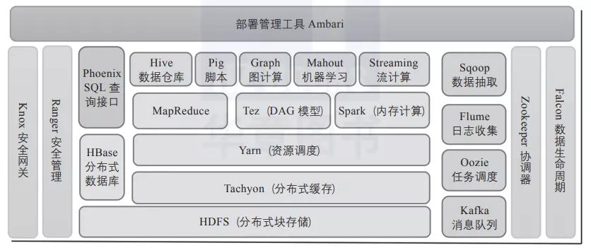
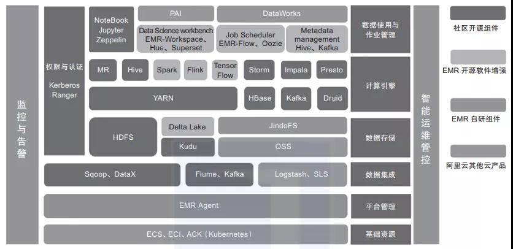

# 一文搞懂Hadoop生态系统

作者： 王春波2022-01-06 18:21:00

[大数据](https://www.51cto.com/bigdata)[Hadoop](https://www.51cto.com/hadoop)

Hadoop体系也是一个计算框架，在这个框架下，可以使用一种简单的编程模式，通过多台计算机构成的集群，分布式处理大数据集。

### 

### 01Hadoop概述

Hadoop体系也是一个计算框架，在这个框架下，可以使用一种简单的编程模式，通过多台计算机构成的集群，分布式处理大数据集。Hadoop是可扩展的，它可以方便地从单一服务器扩展到数千台服务器，每台服务器进行本地计算和存储。除了依赖于硬件交付的高可用性，软件库本身也提供数据保护，并可以在应用层做失败处理，从而在计算机集群的顶层提供高可用服务。Hadoop核心生态圈组件如图1所示。

图1　Haddoop开源生态

### 02Hadoop生态圈

Hadoop包括以下4个基本模块。

1)Hadoop基础功能库：支持其他Hadoop模块的通用程序包。

2)HDFS：一个分布式文件系统，能够以高吞吐量访问应用中的数据。

3)YARN：一个作业调度和资源管理框架。

4)MapReduce：一个基于YARN的大数据并行处理程序。

除了基本模块，Hadoop还包括以下项目。

1)Ambari：基于Web，用于配置、管理和监控Hadoop集群。支持HDFS、MapReduce、Hive、HCatalog、HBase、ZooKeeper、Oozie、Pig和Sqoop。Ambari还提供显示集群健康状况的仪表盘，如热点图等。Ambari以图形化的方式查看MapReduce、Pig和Hive应用程序的运行情况，因此可以通过对用户友好的方式诊断应用的性能问题。

2)Avro：数据序列化系统。

3)Cassandra：可扩展的、无单点故障的NoSQL多主数据库。

4)Chukwa：用于大型分布式系统的数据采集系统。

5)HBase：可扩展的分布式数据库，支持大表的结构化数据存储。

6)Hive：数据仓库基础架构，提供数据汇总和命令行即席查询功能。

7)Mahout：可扩展的机器学习和数据挖掘库。

8)Pig：用于并行计算的高级数据流语言和执行框架。

9)Spark：可高速处理Hadoop数据的通用计算引擎。Spark提供了一种简单而富有表达能力的编程模式，支持ETL、机器学习、数据流处理、图像计算等多种应用。

10)Tez：完整的数据流编程框架，基于YARN建立，提供强大而灵活的引擎，可执行任意有向无环图(DAG)数据处理任务，既支持批处理又支持交互式的用户场景。Tez已经被Hive、Pig等Hadoop生态圈的组件所采用，用来替代 MapReduce作为底层执行引擎。

11)ZooKeeper：用于分布式应用的高性能协调服务。

除了以上这些官方认可的Hadoop生态圈组件之外，还有很多十分优秀的组件这里没有介绍，这些组件的应用也非常广泛，例如基于Hive查询优化的Presto、Impala、Kylin等。

此外，在Hadoop生态圈的周边，还聚集了一群“伙伴”，它们虽然未曾深入融合Hadoop生态圈，但是和Hadoop有着千丝万缕的联系，并且在各自擅长的领域起到了不可替代的作用。图2是阿里云E-MapReduce平台整合的Hadoop生态体系中的组件，比Apache提供的组合更为强大。

图2　阿里云E-MapReduce的产品架构

下面简单介绍其中比较重要的成员。

1)Presto：开源分布式SQL查询引擎，适用于交互式分析查询，数据量支持GB到PB级。Presto可以处理多数据源，是一款基于内存计算的MPP架构查询引擎。

2)Kudu：与HBase类似的列存储分布式数据库，能够提供快速更新和删除数据的功能，是一款既支持随机读写，又支持OLAP分析的大数据存储引擎。

3)Impala：高效的基于MPP架构的快速查询引擎，基于Hive并使用内存进行计算，兼顾ETL功能，具有实时、批处理、多并发等优点。

4)Kylin：开源分布式分析型数据仓库，提供Hadoop/Spark之上的SQL查询接口及多维分析(OLAP)能力，支持超大规模数据的压秒级查询。

5)Flink：一款高吞吐量、低延迟的针对流数据和批数据的分布式实时处理引擎，是实时处理领域的新星。

6)Hudi：Uber开发并开源的数据湖解决方案，Hudi(Hadoop updates and incrementals)支持HDFS数据的修改和增量更新操作。

### 03Hadoop的优缺点

如今，Hadoop已经演化成了一个生态系统，系统内的组件千差万别，有的还是孵化阶段，有的风华正茂，有的垂垂老矣。其中，最经久不衰的当属HDFS和Hive两大组件，昙花一现的包括HBase、MapReduce、Presto等，风华正茂的当属Spark和Flink。

古语有云，“成也萧何，败也萧何”。大数据成功最核心的原因是开源，但它存在的最大的问题也是开源。很多组件虽然依靠开源可以快速成熟，但是一旦成熟，就会出现生态紊乱和版本割裂的情况，其中最典型的就是Hive。

Hive 1.x之前的版本功能不完善，1.x版和2.x版算是逐步优化到基本可用了，到了3.x版又出现了各种问题，并且大部分云平台Hive版本都停留在2.x版，新版本推广乏力。另外，Hive的计算引擎也是饱受争议的，Hive支持的计算引擎主要有MapReduce、Tez、Spark、Presto。十多年来MapReduce的计算速度并没有提升;Tez虽然计算速度快，但是安装需要定制化编译和部署;Spark的计算速度最快，但是对JDBC支持不友好;Presto计算速度快并且支持JDBC，但是语法又和Hive不一致。申明一下，这里说的快只是相对MapReduce引擎而言的，跟传统数据库的速度相比仍然相差1到2个数量级。

总的来说，基于Hadoop开发出来的大数据平台，通常具有以下特点。

1)扩容能力：能够可靠地存储和处理PB级的数据。Hadoop生态基本采用HDFS作为存储组件，吞吐量高、稳定可靠。

2)成本低：可以利用廉价、通用的机器组成的服务器群分发、处理数据。这些服务器群总计可达数千个节点。

3)高效率：通过分发数据，Hadoop可以在数据所在节点上并行处理，处理速度非常快。

4)可靠性：Hadoop能自动维护数据的多份备份，并且在任务失败后能自动重新部署计算任务。

Hadoop生态同时也存在不少缺点。

1)因为Hadoop采用文件存储系统，所以读写时效性较差，至今没有一款既支持快速更新又支持高效查询的组件。

2)Hadoop生态系统日趋复杂，组件之间的兼容性差，安装和维护比较困难。

3)Hadoop各个组件功能相对单一，优点很明显，缺点也很明显。

4)云生态对Hadoop的冲击十分明显，云厂商定制化组件导致版本分歧进一步扩大，无法形成合力。

5)整体生态基于Java开发，容错性较差，可用性不高，组件容易挂掉。

关于作者：王春波，资深架构师和数据仓库专家，现任上海启高信息科技有限公司大数据架构师，Apache Doris和openGauss贡献者，Greenplum中文社区参与者。 公众号“数据中台研习社”运营者。

 

本文摘编于《高效使用Greenplum：入门、进阶与数据中台》，经出版方授权发布。(书号：9787111696490)转载请保留文章来源。

 

责任编辑：武晓燕来源： [数仓宝贝库](https://mp.weixin.qq.com/s/J7igFTrwYME7N3xEIlV-mQ)

[Hadoop](https://so.51cto.com/?keywords=Hadoop)[生态](https://so.51cto.com/?keywords=生态)[系统](https://so.51cto.com/?keywords=系统)